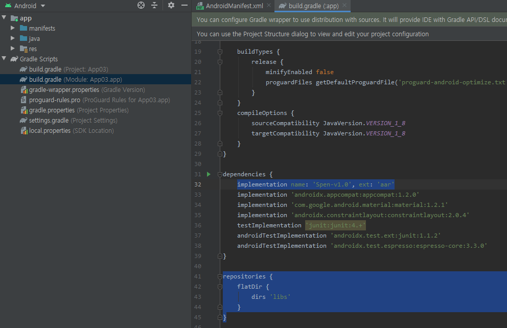
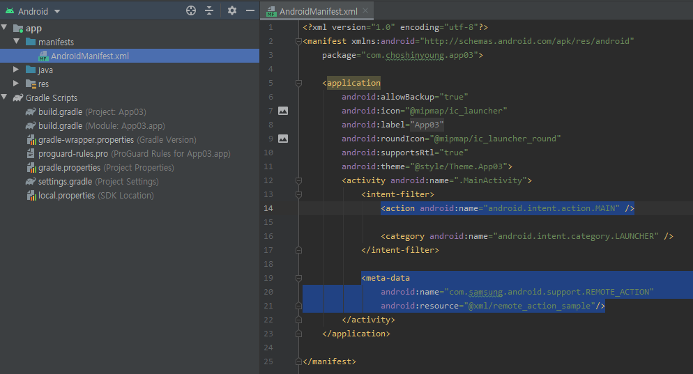

Spen
====

<p align="center">
    <span>한국어</span> |
    <a href="README_en.md">English</a>
</p>

<br>

복잡한 Air Action과 S pen Remote SDK를 간단하게 사용할 수 있는 안드로이드 라이브러리입니다.

- Android 9.0 이상의 Note10 또는 Tab S6부터 사용할 수 있습니다.
- Remote와 Air Action은 동시에 사용할 수 없습니다.


기본 설정
--------

1. 새 프로젝트를 만드세요.

2. `Project` 창에서 `Project` 뷰를 여세요.

3. `app/libs` 폴더에 [`Spen-v1.0.arr`](releases/tag/v1.0)을 복사하세요.

4. 다시 `Android` 뷰로 가서, `Gradle Scripts` 안의 `build.gradle (Module: ~.app)`을 여세요.

5. 파일의 맨 아래  
    ```gradle
    repositories {
        flatDir {
            dirs 'libs'
        }
    } 
    ``` 
를 추가하세요.

6. `dependencies` 안에 
    ```gradle
    implementation name: 'Spen-v1.0', ext: 'aar'
    ```
    을 추가하고, `Sync Now`를 누르세요.
 



***


Spen Remote
-----------

1. MainActivity(또는 다른 클래스)에서 `SpenRemoteEventReceiver`를 implements하세요.

2. `spen`이라는 이름의 `SpenUnitManager` 타입의 변수를 만들고 `onCreate` 메서드에서 ```SpenRemoteController.create(this, this)``` 로 초기화하세요.
    - 첫번째 매개변수는 `Context`이고, 두번째 매개변수는 `SpenRemoteEventReceiver`입니다.

3. `onResume` 메서드를 오버라이드하고 ```spen.initSpenRemote();```를 사용해 s펜에 연결하세요.

4. `onPause`를 오버라이드하고 ```spen.releaseSpenRemote();```를 추가하세요.

5. 이제 `SpenButtonEvent`와 `SpenAirMotionEvent`메서드를 오버라이드해 이벤트를 사용할 수 있습니다.
    - `SpenButtonEvent`는 S펜의 버튼을 누르거나 땔 때 호출됩니다. `SpenAirMotionEvent`는 S펜이 움직일 때마다 호출됩니다.
    - `spen.buttonPressed`로 버튼이 눌려있는지 확인할 수 있습니다. `SpenAirMotionEvent`에서 ```event.getDeltaX()``` 와 ```event.getDaltaY()``` 로 자이로 센서값을 얻을 수 있습니다.

[전체 코드 보기](Examples/RemoteExample.java)


Air Action
----------

1. `AndroidManifest.xml`를 열고, `<intent-filter>` 안에 `<action android:name="com.samsung.android.support.REMOTE_ACTION" />`를 적으세요.

2. `<intent-filter>` 아래에는
    ```xml
    <meta-data
        android:name="com.samsung.android.support.REMOTE_ACTION"
        android:resource="@xml/remote_action_sample"/>
    ``` 
    를 추가하세요.



3. `SpenAirActionEventReceiver`를 implements하세요.

4. `SpenAirActionController` 타입의 `spen` 변수를 만들고, `onCreate`에서 ```SpenAirActionController.create(this);``` 로 초기화하세요
    - 매개변수는 `SpenAirActionEventReceiver` 타입입니다.

5. `onKeyDown`을 오버라이드하고 ```spen.KeyDown(keyCode, event);```를 추가하세요.

6. 이제 `SpenAirActionEventReceiver`의 메서드 `onClick`, `onDoubleClick`, `onSwipeRight`, `onSwipeLeft`, `onSwipeDown`, `onSwipeUp`, `onCircleCw`, `onCircleCcw` 중 필요한 메서드를 오버라이드해 이벤트를 사용할 수 있습니다.

7. 개별 메서드 대신 `onSwipe`, `onCircle`를 사용할 수 있습니다. `onSwipe`에서는 매개변수 direction이 0이면 오른쪽, 1이면 왼쪽, 2는 위, 3은 아래입니다. `onCircle`에서는 direction이 0이면 시계방향, 1이면 반대방향입니다 (`SpenAirActionEventReceiver`에 `UP`, `DOWN`, `RIGHT`, `LEFT`가 static 변수로 미리 선언돼있습니다).

8. Air Action이 적용된 앱을 처음 사용할 때는 S펜의 `에어 엑션` 설정에서 해당 앱을 활성화해야 합니다.

[전체 코드 보기](Examples/AirActionExample.java)

***

[Galaxy S Pen](https://developer.samsung.com/galaxy-spen-remote/)   
