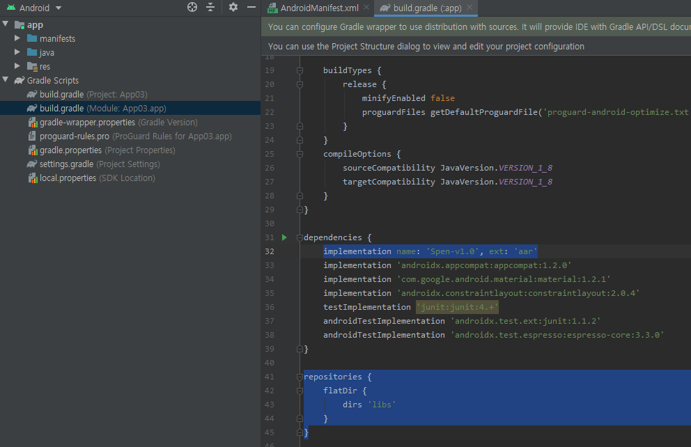

Spen
====

<p align="center">
    <a href="README.md">한국어</a> |
    <span>English</span>
</p>

<br>

An android library that makes it easy to use Air Action and S pen Remote SDK

- Available since Note 10 or Tab S6 that running at least Android 9.0 or higher.
- Cannot use Air Action and Spen Remote at the same time.


Setup
--------

1. Create a new project.

2. Open `Project` view in the `Project` window.

3. Copy and paste `Spen-v1.0.arr` to `app/libs` folder.

4. Go to `Android` view again, and open `build.gradle (Module: ~.app)` in `Gradle Scripts`.

5. Add 
    ```gradle
    repositories {
        flatDir {
            dirs 'libs'
        }
    } 
    ``` 
    at the very bottom.

6. Inside a `dependencies`, Add
    ```gradle
    implementation name: 'Spen-v1.0', ext: 'aar'
    ```
    and click `Sync Now`.
 



***


Spen Remote
-----------

1. Implement `SpenRemoteEventReceiver` to MainActivity(or another class).

2. Make the `SpenUnitManager` type variable named "spen" and initialize in the `onCreate` method with ```SpenRemoteController.create(this, this)```
    - The first parameter is the `Context` type, and the second is the `SpenRemoteEventReceiver` type.

3. Override `onResume` method and connect to S pen with ```spen.initSpenRemote();```.

4. Override `onPause` and add ```spen.releaseSpenRemote();```.

5. Now you can use events by overriding `SpenButtonEvent` and `SpenAirMotionEvent` method.
    - `SpenButtonEvent` is called when button down or up with `spen.buttonPressed`. `SpenAirMotionEvent` is called whenever the S pen moved.
    - You can check if the button is down. You can get gyroscope senser value with ```event.getDeltaX()``` and ```event.getDaltaY()``` from `SpenAirMotionEvent`.

[Read Full Code](Examples/RemoteExample.java)


Air Action
----------

1. Open `AndroidManifest.xml` and write `<action android:name="com.samsung.android.support.REMOTE_ACTION" />` inside a `<intent-filter>`.

2. Down the `<intent-filter>`, Add
    ```xml
    <meta-data
        android:name="com.samsung.android.support.REMOTE_ACTION"
        android:resource="@xml/remote_action_sample"/>
    ``` 


3. Implement the `SpenAirActionEventReceiver`.

4. Create `SpenAirActionController` type variable named `spen`, and initialize by ```SpenAirActionController.create(this);``` in `onCreate`.
    - A type of the parameter is `SpenAirActionEventReceiver`.

5. Override `onKeyDown` and add ```spen.KeyDown(keyCode, event);```.

6. Now you can use events by overriding methods you need in `onClick`, `onDoubleClick`, `onSwipeRight`, `onSwipeLeft`, `onSwipeDown`, `onSwipeUp`, `onCircleCw`, `onCircleCcw` from `SpenAirActionEventReceiver`.

7. You can also use the `onSwipe` and `onCircle` method instead of the indivisual methods. In `onSwipe`, the parameter is 0 if right, 1 if left, 2 if up, 3 if down. In `onCircle`, In `onCircle`, the parameter is 0 for clickwise direction, and 1 for counter-clickwise direction. (`UP`, `DOWN`, `RIGHT`, `LEFT` is pre decalered as static variables in `SpenAirActionEventReceiver`)

8. If you use your Air Action app the first time, you need to enable this application from `Air Action` in S pen settings.

[Read Full Code](Examples/AirActionExample.java)

***

[Galaxy S Pen](https://developer.samsung.com/galaxy-spen-remote/)   
